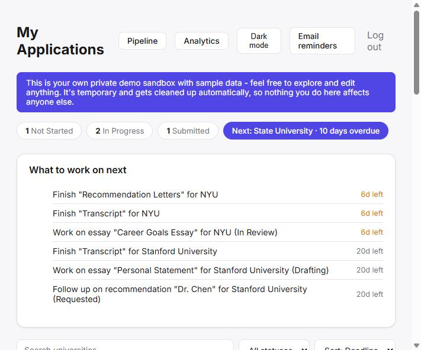
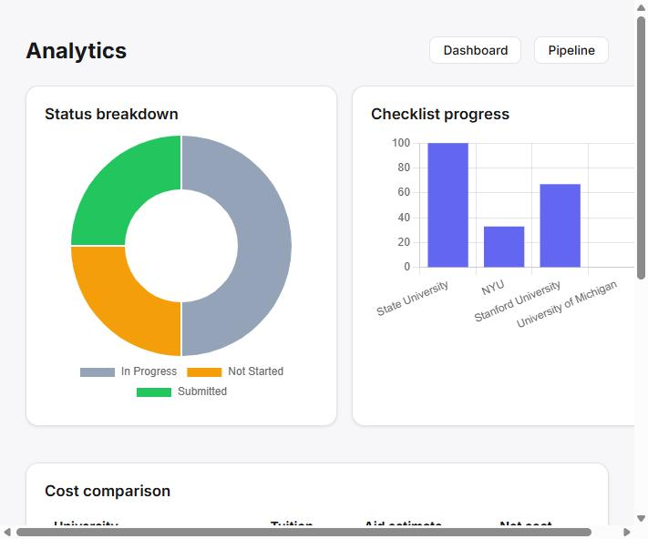

# University Application Tracker

A full-featured web app for tracking college applications - deadlines, essays, recommendation letters, documents, costs, and progress - built solo from scratch while learning Python and web development.

**Live app:** https://uni-app-tracker-b70h.onrender.com/
*(hosted on a free tier - may take ~30s to wake up on first visit)*

**Try it instantly, no account needed:** click "Try the demo" on the login page, or go straight to [`/demo-login`](https://uni-app-tracker-b70h.onrender.com/demo-login). Every visitor gets their own private, isolated sandbox seeded with realistic sample data.




## Features

**Application tracking**
- University profiles with program, application portal link, tuition cost, and financial aid estimate (with automatic net-cost calculation)
- Per-university checklist, plus dedicated essay, recommendation letter, and document tracking - each with its own status flow
- Smart deadline countdowns ("5 days left" / "3 days overdue")
- Free-text notes per application
- **Duplicate application** - clone a university's checklist, essays, and recommenders into a new entry (statuses reset) so a new application doesn't start from scratch
- **Soft delete with undo** - deleting a university doesn't destroy it immediately; a one-click "Undo" restores it, with old deleted entries purged automatically after 30 days
- **Export** - download all applications as CSV, or as an .ics calendar file of every deadline

**Dashboard & insights**
- Personal dashboard with status counts, nearest deadline, search, filter, and sort
- **Readiness Score** per school - a 0-100% blend of checklist, essay, recommendation, and document completion
- **Smart Suggestions** - a rule-based "what to work on next" panel, ranking every incomplete task across all schools by urgency
- **Pipeline view** - applications grouped into Not Started / In Progress / Submitted columns with one-click stage advancement
- **Analytics** - status breakdown and progress charts (Chart.js), a cost comparison table, and a chronological deadline timeline

**Accounts & access**
- Real user accounts: signup/login with hashed passwords, CSRF protection on every form, and login rate limiting
- Full data isolation - every query is scoped to the logged-in user, enforced server-side
- **Demo mode** - every visitor gets a private, temporary, fully-isolated sandbox (auto-cleaned after 24 hours) with no account required
- Guided onboarding for brand-new accounts

**Automation & reliability**
- Automatic daily email reminder for approaching deadlines (via [Resend](https://resend.com), since most free hosts block raw SMTP)
- Scheduled demo-account cleanup, both run via GitHub Actions
- Dark mode, responsive layout

## Tech stack

- **Backend:** Python, Flask
- **Database:** SQLite locally, [Turso](https://turso.tech) (hosted, SQLite-compatible) in production - required because Render's free tier has no persistent filesystem
- **Frontend:** HTML/CSS with Jinja templates, [Chart.js](https://www.chartjs.org/) for analytics
- **Auth:** Flask sessions, hashed passwords (werkzeug), hand-rolled CSRF tokens and login rate limiting
- **Email:** Resend HTTP API (`urllib`, no extra dependency)
- **Automation:** GitHub Actions (scheduled reminders, scheduled demo cleanup)
- **Tests:** pytest with Flask's test client

## Architecture notes

- **One unified `tasks` table** (not four) covers checklist items, essays, recommendation letters, and documents, distinguished by a `task_type` column with a few nullable type-specific fields. Same CRUD routes and ownership checks handle all four.
- **Per-user data isolation** is enforced at the query level everywhere (`WHERE user_id = ?`), not just at the UI layer - verified with a dedicated test that one account can never see another's data.
- **Demo accounts** are real rows in the same tables as everyone else, just flagged `is_demo` and swept by a scheduled cleanup job - not a separate code path that could drift out of sync.

For the real story of what broke and how it got fixed along the way - Render's ephemeral filesystem eating the database, a native dependency that couldn't build on Windows, a production-only deadlock in a forked process, outbound email silently blocked - see **[DEVLOG.md](DEVLOG.md)**.

## Running it locally

```
python -m venv venv
venv\Scripts\activate
pip install -r requirements.txt
```

Create a `.env` file (see `.env.example`) with your own `SECRET_KEY`. To enable the "Email reminders" button, also add `EMAIL_ADDRESS` and a [Resend](https://resend.com) `RESEND_API_KEY` - otherwise leave them out and the button just won't show up. Then:

```
python app.py
```

Open `http://127.0.0.1:5000` in your browser and sign up for an account.

## Running the tests

```
pip install -r requirements-dev.txt
pytest -v
```

Tests run against a separate temporary database, so they never touch your real data.

## What I learned building this

This was my first real project after starting to learn to code, and it grew from a simple checklist app into a full-featured multi-user product. Along the way it took me through:
- Python fundamentals (variables, functions, loops, dictionaries) up through database schema design and migrations
- Building a web server, routes, and a real authentication system with Flask
- Reading and writing data with SQL, and designing a schema that reuses one flexible model instead of four rigid ones
- Diagnosing production-only bugs (a forked-process deadlock, a blocked network port) that never showed up locally
- Separating logic (Python) from presentation (HTML templates) and styling with CSS
- Setting up CI-style automation (GitHub Actions) for scheduled jobs
